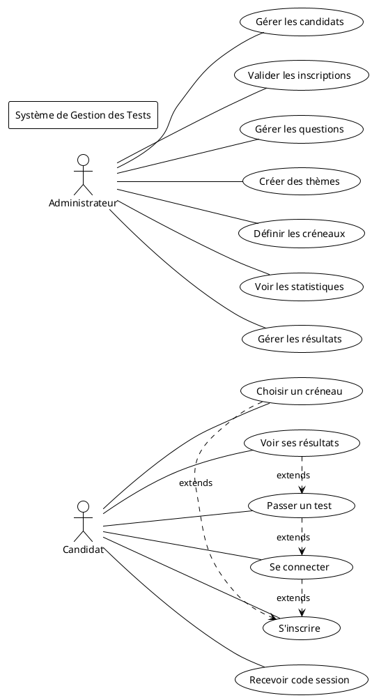
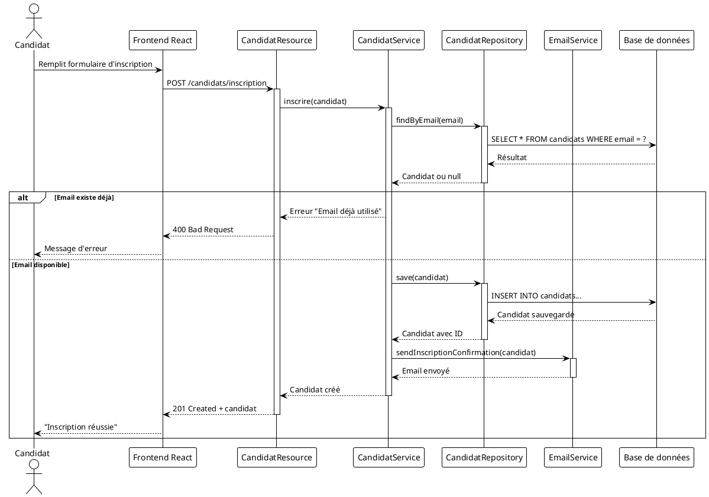
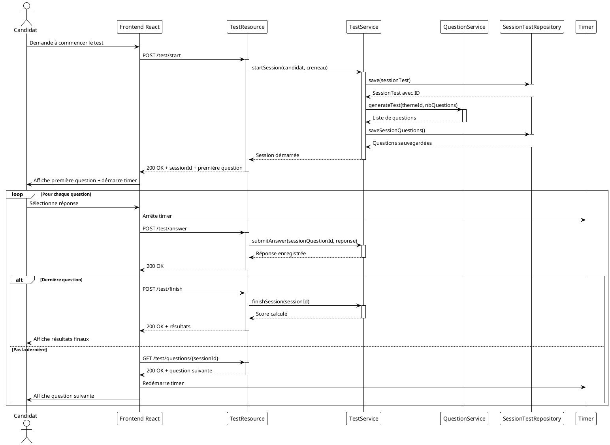
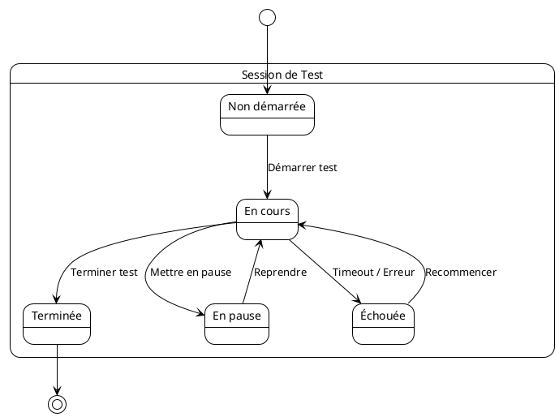
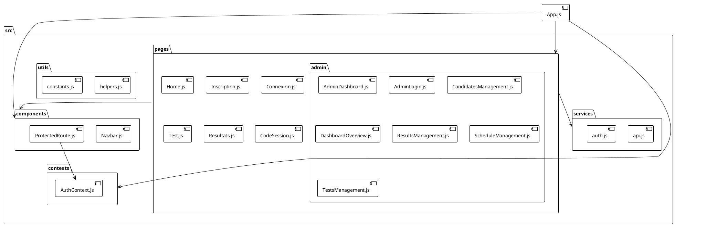
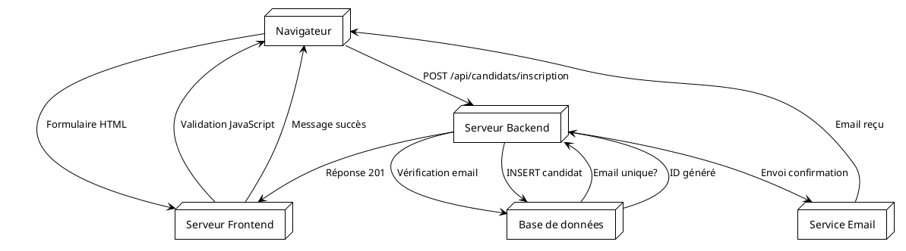

# Diagrammes UML - Application de Gestion des Tests en Ligne

## 1. Diagramme de Classes (Backend)

```plantuml
@startuml
!theme plain

package "Entités JPA" {
    class Candidat {
        - Integer id
        - String nom
        - String prenom
        - String ecole
        - String filiere
        - String email
        - String gsm
        - String codeSession
        - Boolean estValide
        - LocalDateTime createdAt
        --
        + getters/setters
    }
    
    class Theme {
        - Integer id
        - String nom
        - String description
        - LocalDateTime createdAt
        --
        + getters/setters
    }
    
    class TypeQuestion {
        - Integer id
        - String nom
        - String description
        --
        + getters/setters
    }
    
    class Question {
        - Integer id
        - Theme theme
        - TypeQuestion typeQuestion
        - String libelle
        - String explication
        - LocalDateTime createdAt
        --
        + getters/setters
    }
    
    class ReponsePossible {
        - Integer id
        - Question question
        - String libelle
        - Boolean estCorrect
        --
        + getters/setters
    }
    
    class CreneauHoraire {
        - Integer id
        - LocalDate dateExam
        - LocalTime heureDebut
        - LocalTime heureFin
        - Integer dureeMinutes
        - Integer placesDisponibles
        - Boolean estComplet
        - LocalDateTime createdAt
        --
        + getters/setters
    }
    
    class Inscription {
        - Integer id
        - Candidat candidat
        - CreneauHoraire creneau
        - LocalDateTime dateInscription
        - Boolean estConfirme
        --
        + getters/setters
    }
    
    class SessionTest {
        - Integer id
        - Candidat candidat
        - CreneauHoraire creneau
        - String codeSession
        - LocalDateTime dateDebut
        - LocalDateTime dateFin
        - Boolean estTermine
        - Integer scoreTotal
        - Integer scoreMax
        - BigDecimal pourcentage
        --
        + getters/setters
        + calculerPourcentage()
    }
    
    class SessionQuestion {
        - Integer id
        - SessionTest sessionTest
        - Question question
        - Integer ordreAffichage
        - Integer tempsAlloue
        --
        + getters/setters
    }
    
    class ReponseCandidat {
        - Integer id
        - SessionQuestion sessionQuestion
        - ReponsePossible reponsePossible
        - String reponseText
        - Integer tempsReponse
        - LocalDateTime dateReponse
        - Boolean estCorrect
        --
        + getters/setters
    }
    
    class Administrateur {
        - Integer id
        - String username
        - String password
        - String email
        - String nom
        - String prenom
        - Boolean estActif
        - LocalDateTime createdAt
        --
        + getters/setters
    }
    
    class Parametre {
        - Integer id
        - String nomParam
        - String valeur
        - String description
        - LocalDateTime updatedAt
        --
        + getters/setters
    }
}

package "Repositories" {
    interface CandidatRepository {
        + findByEmail(String email)
        + findByCodeSession(String code)
        + findByEstValide(Boolean valide)
    }
    
    interface ThemeRepository {
        + findByNom(String nom)
    }
    
    interface QuestionRepository {
        + findByThemeId(Integer idTheme)
        + findRandomQuestions(Integer idTheme, Integer limit)
    }
    
    interface SessionTestRepository {
        + findByCandidatId(Integer idCandidat)
        + findByCodeSession(String code)
    }
}

package "Services" {
    class CandidatService {
        - CandidatRepository candidatRepository
        - EmailService emailService
        --
        + inscrire(Candidat candidat)
        + validerCandidat(Integer id)
        + rejeterCandidat(Integer id)
        + envoyerCodeSession(Integer id)
        + connecter(String email, String code)
    }
    
    class QuestionService {
        - QuestionRepository questionRepository
        --
        + getQuestionsByTheme(Integer idTheme)
        + generateTest(Integer idTheme, Integer nbQuestions)
    }
    
    class TestService {
        - SessionTestRepository sessionTestRepository
        - SessionQuestionRepository sessionQuestionRepository
        --
        + startSession(Candidat candidat, CreneauHoraire creneau)
        + submitAnswer(Integer idSessionQuestion, ReponseCandidat reponse)
        + finishSession(Integer idSession)
        + calculateScore(Integer idSession)
    }
    
    class EmailService {
        + sendInscriptionConfirmation(Candidat candidat)
        + sendCodeSession(Candidat candidat)
        + sendResultNotification(Candidat candidat)
    }
}

package "REST API" {
    class CandidatResource {
        - CandidatService candidatService
        --
        + POST /candidats/inscription
        + POST /candidats/connexion
        + GET /candidats/profile
    }
    
    class TestResource {
        - TestService testService
        --
        + POST /test/start
        + GET /test/questions/{sessionId}
        + POST /test/answer
        + POST /test/finish
    }
    
    class AdministrationResource {
        - CandidatService candidatService
        - QuestionService questionService
        --
        + GET /admin/candidats
        + POST /admin/candidats/{id}/valider
        + POST /admin/candidats/{id}/rejeter
        + GET /admin/statistics
    }
}

' Relations entre entités
Candidat "1" --> "0..*" Inscription : inscriptions
Candidat "1" --> "0..*" SessionTest : sessions

CreneauHoraire "1" --> "0..*" Inscription : inscriptions
CreneauHoraire "1" --> "0..*" SessionTest : sessions

Theme "1" --> "0..*" Question : questions
TypeQuestion "1" --> "0..*" Question : questions
Question "1" --> "0..*" ReponsePossible : reponsesPossibles

SessionTest "1" --> "0..*" SessionQuestion : sessionQuestions
SessionQuestion "1" --> "0..*" ReponseCandidat : reponsesCandidats
Question "1" --> "0..*" SessionQuestion : sessionQuestions
ReponsePossible "0..1" --> "0..*" ReponseCandidat : reponsesCandidats

' Relations avec les services
CandidatService --> CandidatRepository
CandidatService --> EmailService
QuestionService --> QuestionRepository
TestService --> SessionTestRepository
TestService --> SessionQuestionRepository

' Relations avec les REST controllers
CandidatResource --> CandidatService
TestResource --> TestService
AdministrationResource --> CandidatService
AdministrationResource --> QuestionService

@enduml
```



## 2. Diagramme de Cas d'Utilisation



## 3. Diagramme de Séquence - Processus d'Inscription



## 4. Diagramme de Séquence - Processus de Test



## 5. Diagramme d'Architecture Système

```plantuml
@startuml
!theme plain

package "Frontend" {
    [React.js Application] as Frontend
    [AuthContext] as Auth
    [Components] as Components
}

package "Backend" {
    [WildFly Server] as Server
    [Jakarta EE] as JEE
    [JAX-RS API] as REST
    [JPA/Hibernate] as JPA
}

package "Base de données" {
    [MySQL Server] as MySQL
    [gestion_tests DB] as DB
}

package "Services externes" {
    [Service Email] as Email
}

Frontend --> REST : HTTP/REST API
REST --> JEE : Business Logic
JEE --> JPA : Data Access
JPA --> MySQL : JDBC
MySQL --> DB : Tables

JEE --> Email : SMTP

note right of Frontend
  - React.js
  - React Router
  - Tailwind CSS
  - Axios
end note

note right of Server
  - WildFly 27
  - Jakarta EE 10
  - JAX-RS
  - CDI
end note

note right of MySQL
  - MySQL 8.0
  - 15 tables
  - Relations étrangères
end note

@enduml
```

## 6. Diagramme d'États - Session de Test



## 7. Diagramme de Packages Frontend



## 8. Diagramme de Flux de Données - Inscription



## Résumé des Diagrammes

Ces diagrammes UML couvrent tous les aspects de votre application :

1. **Diagramme de Classes** : Structure complète du backend avec entités, services, repositories et API REST
2. **Cas d'Utilisation** : Fonctionnalités principales pour les candidats et administrateurs
3. **Séquence - Inscription** : Flux complet d'inscription d'un candidat
4. **Séquence - Test** : Processus complet de passage d'un test avec timer
5. **Architecture Système** : Vue d'ensemble de l'architecture technique
6. **États - Session Test** : Différents états d'une session de test
7. **Packages Frontend** : Organisation du code React.js
8. **Flux de Données** : Circulation des informations lors de l'inscription

Ces diagrammes peuvent être utilisés pour :
- Documenter le projet pour l'équipe de développement
- Former de nouveaux développeurs
- Planifier des évolutions futures
- Auditer et maintenir l'application
