# Diagramme de Classes - Gestion des Tests en Ligne

```plantuml
@startuml
!theme plain
skinparam classAttributeIconSize 0

package "Entités JPA (Entity Layer)" #E6F3FF {
    
    class Candidat {
        - Integer id
        - String nom
        - String prenom
        - String ecole
        - String filiere
        - String email
        - String gsm
        - String codeSession
        - Boolean estValide
        - LocalDateTime createdAt
        --
        + getId(): Integer
        + getNom(): String
        + setNom(String): void
        + getPrenom(): String
        + setPrenom(String): void
        + getEmail(): String
        + setEmail(String): void
        + getCodeSession(): String
        + setCodeSession(String): void
        + getEstValide(): Boolean
        + setEstValide(Boolean): void
    }
    
    class Theme {
        - Integer id
        - String nom
        - String description
        - LocalDateTime createdAt
        --
        + getId(): Integer
        + getNom(): String
        + setNom(String): void
        + getDescription(): String
        + setDescription(String): void
    }
    
    class TypeQuestion {
        - Integer id
        - String nom
        - String description
        --
        + getId(): Integer
        + getNom(): String
        + setNom(String): void
        + getDescription(): String
        + setDescription(String): void
    }
    
    class Question {
        - Integer id
        - Theme theme
        - TypeQuestion typeQuestion
        - String libelle
        - String explication
        - LocalDateTime createdAt
        --
        + getId(): Integer
        + getTheme(): Theme
        + setTheme(Theme): void
        + getTypeQuestion(): TypeQuestion
        + setTypeQuestion(TypeQuestion): void
        + getLibelle(): String
        + setLibelle(String): void
        + getExplication(): String
        + setExplication(String): void
    }
    
    class ReponsePossible {
        - Integer id
        - Question question
        - String libelle
        - Boolean estCorrect
        --
        + getId(): Integer
        + getQuestion(): Question
        + setQuestion(Question): void
        + getLibelle(): String
        + setLibelle(String): void
        + getEstCorrect(): Boolean
        + setEstCorrect(Boolean): void
    }
    
    class CreneauHoraire {
        - Integer id
        - LocalDate dateExam
        - LocalTime heureDebut
        - LocalTime heureFin
        - Integer dureeMinutes
        - Integer placesDisponibles
        - Boolean estComplet
        - LocalDateTime createdAt
        --
        + getId(): Integer
        + getDateExam(): LocalDate
        + setDateExam(LocalDate): void
        + getHeureDebut(): LocalTime
        + setHeureDebut(LocalTime): void
        + getPlacesDisponibles(): Integer
        + setPlacesDisponibles(Integer): void
        + getEstComplet(): Boolean
        + setEstComplet(Boolean): void
    }
    
    class Inscription {
        - Integer id
        - Candidat candidat
        - CreneauHoraire creneau
        - LocalDateTime dateInscription
        - Boolean estConfirme
        --
        + getId(): Integer
        + getCandidat(): Candidat
        + setCandidat(Candidat): void
        + getCreneau(): CreneauHoraire
        + setCreneau(CreneauHoraire): void
        + getEstConfirme(): Boolean
        + setEstConfirme(Boolean): void
    }
    
    class SessionTest {
        - Integer id
        - Candidat candidat
        - CreneauHoraire creneau
        - String codeSession
        - LocalDateTime dateDebut
        - LocalDateTime dateFin
        - Boolean estTermine
        - Integer scoreTotal
        - Integer scoreMax
        - BigDecimal pourcentage
        --
        + getId(): Integer
        + getCandidat(): Candidat
        + setCandidat(Candidat): void
        + getCreneau(): CreneauHoraire
        + setCreneau(CreneauHoraire): void
        + getCodeSession(): String
        + setCodeSession(String): void
        + getDateDebut(): LocalDateTime
        + setDateDebut(LocalDateTime): void
        + getDateFin(): LocalDateTime
        + setDateFin(LocalDateTime): void
        + getEstTermine(): Boolean
        + setEstTermine(Boolean): void
        + getScoreTotal(): Integer
        + setScoreTotal(Integer): void
        + getScoreMax(): Integer
        + setScoreMax(Integer): void
        + getPourcentage(): BigDecimal
        + setPourcentage(BigDecimal): void
        + calculerPourcentage(): void
    }
    
    class SessionQuestion {
        - Integer id
        - SessionTest sessionTest
        - Question question
        - Integer ordreAffichage
        - Integer tempsAlloue
        --
        + getId(): Integer
        + getSessionTest(): SessionTest
        + setSessionTest(SessionTest): void
        + getQuestion(): Question
        + setQuestion(Question): void
        + getOrdreAffichage(): Integer
        + setOrdreAffichage(Integer): void
        + getTempsAlloue(): Integer
        + setTempsAlloue(Integer): void
    }
    
    class ReponseCandidat {
        - Integer id
        - SessionQuestion sessionQuestion
        - ReponsePossible reponsePossible
        - String reponseText
        - Integer tempsReponse
        - LocalDateTime dateReponse
        - Boolean estCorrect
        --
        + getId(): Integer
        + getSessionQuestion(): SessionQuestion
        + setSessionQuestion(SessionQuestion): void
        + getReponsePossible(): ReponsePossible
        + setReponsePossible(ReponsePossible): void
        + getReponseText(): String
        + setReponseText(String): void
        + getTempsReponse(): Integer
        + setTempsReponse(Integer): void
        + getEstCorrect(): Boolean
        + setEstCorrect(Boolean): void
    }
    
    class Administrateur {
        - Integer id
        - String username
        - String password
        - String email
        - String nom
        - String prenom
        - Boolean estActif
        - LocalDateTime createdAt
        --
        + getId(): Integer
        + getUsername(): String
        + setUsername(String): void
        + getPassword(): String
        + setPassword(String): void
        + getEmail(): String
        + setEmail(String): void
        + getEstActif(): Boolean
        + setEstActif(Boolean): void
    }
    
    class Parametre {
        - Integer id
        - String nomParam
        - String valeur
        - String description
        - LocalDateTime updatedAt
        --
        + getId(): Integer
        + getNomParam(): String
        + setNomParam(String): void
        + getValeur(): String
        + setValeur(String): void
        + getDescription(): String
        + setDescription(String): void
    }
}

package "Repositories (Data Access Layer)" #FFE6E6 {
    
    interface CandidatRepository {
        + findByEmail(String email): Optional<Candidat>
        + findByCodeSession(String code): Optional<Candidat>
        + findByEstValide(Boolean valide): List<Candidat>
        + save(Candidat candidat): Candidat
        + findById(Integer id): Optional<Candidat>
        + findAll(): List<Candidat>
        + deleteById(Integer id): void
    }
    
    interface ThemeRepository {
        + findByNom(String nom): Optional<Theme>
        + save(Theme theme): Theme
        + findById(Integer id): Optional<Theme>
        + findAll(): List<Theme>
    }
    
    interface QuestionRepository {
        + findByThemeId(Integer idTheme): List<Question>
        + findRandomQuestions(Integer idTheme, Integer limit): List<Question>
        + save(Question question): Question
        + findById(Integer id): Optional<Question>
        + findAll(): List<Question>
    }
    
    interface SessionTestRepository {
        + findByCandidatId(Integer idCandidat): List<SessionTest>
        + findByCodeSession(String code): Optional<SessionTest>
        + save(SessionTest session): SessionTest
        + findById(Integer id): Optional<SessionTest>
    }
    
    interface CreneauHoraireRepository {
        + findByDateExamAfter(LocalDate date): List<CreneauHoraire>
        + findByEstCompletFalse(): List<CreneauHoraire>
        + save(CreneauHoraire creneau): CreneauHoraire
        + findById(Integer id): Optional<CreneauHoraire>
    }
}

package "Services (Business Logic Layer)" #E6FFE6 {
    
    class CandidatService {
        - CandidatRepository candidatRepository
        - EmailService emailService
        --
        + inscrire(Candidat candidat): Candidat
        + validerCandidat(Integer id): Candidat
        + rejeterCandidat(Integer id): void
        + envoyerCodeSession(Integer id): void
        + connecter(String email, String code): Optional<Candidat>
        + findByEmail(String email): Optional<Candidat>
        + getAllCandidats(): List<Candidat>
    }
    
    class QuestionService {
        - QuestionRepository questionRepository
        - ThemeRepository themeRepository
        --
        + getQuestionsByTheme(Integer idTheme): List<Question>
        + generateTest(Integer idTheme, Integer nbQuestions): List<Question>
        + createQuestion(Question question): Question
        + updateQuestion(Question question): Question
        + deleteQuestion(Integer id): void
    }
    
    class TestService {
        - SessionTestRepository sessionTestRepository
        - SessionQuestionRepository sessionQuestionRepository
        - ReponseCandidatRepository reponseCandidatRepository
        --
        + startSession(Candidat candidat, CreneauHoraire creneau): SessionTest
        + submitAnswer(Integer idSessionQuestion, ReponseCandidat reponse): ReponseCandidat
        + finishSession(Integer idSession): SessionTest
        + calculateScore(Integer idSession): SessionTest
        + getSessionQuestions(Integer idSession): List<SessionQuestion>
    }
    
    class EmailService {
        + sendInscriptionConfirmation(Candidat candidat): void
        + sendCodeSession(Candidat candidat): void
        + sendResultNotification(Candidat candidat): void
        + sendRejectionNotification(Candidat candidat): void
    }
    
    class CreneauHoraireService {
        - CreneauHoraireRepository creneauRepository
        --
        + getCreneauxDisponibles(): List<CreneauHoraire>
        + createCreneau(CreneauHoraire creneau): CreneauHoraire
        + updateCreneau(CreneauHoraire creneau): CreneauHoraire
        + inscrireCandidat(Integer idCreneau, Integer idCandidat): Inscription
    }
}

package "REST API (Presentation Layer)" #FFFFE6 {
    
    class CandidatResource {
        - CandidatService candidatService
        --
        + POST /candidats/inscription: Response
        + POST /candidats/connexion: Response
        + GET /candidats/profile: Response
        + GET /candidats/{id}: Response
        + PUT /candidats/{id}: Response
    }
    
    class TestResource {
        - TestService testService
        --
        + POST /test/start: Response
        + GET /test/questions/{sessionId}: Response
        + POST /test/answer: Response
        + POST /test/finish: Response
        + GET /test/results/{sessionId}: Response
    }
    
    class AdministrationResource {
        - CandidatService candidatService
        - QuestionService questionService
        - CreneauHoraireService creneauService
        --
        + GET /admin/candidats: Response
        + POST /admin/candidats/{id}/valider: Response
        + POST /admin/candidats/{id}/rejeter: Response
        + POST /admin/candidats/{id}/envoyer-code: Response
        + GET /admin/statistics: Response
        + GET /admin/questions: Response
        + POST /admin/questions: Response
        + GET /admin/creneaux: Response
        + POST /admin/creneaux: Response
    }
}

' Relations entre entités
Candidat "1" --> "0..*" Inscription : inscriptions
Candidat "1" --> "0..*" SessionTest : sessions

CreneauHoraire "1" --> "0..*" Inscription : inscriptions
CreneauHoraire "1" --> "0..*" SessionTest : sessions

Theme "1" --> "0..*" Question : questions
TypeQuestion "1" --> "0..*" Question : questions
Question "1" --> "0..*" ReponsePossible : reponsesPossibles

SessionTest "1" --> "0..*" SessionQuestion : sessionQuestions
SessionQuestion "1" --> "0..*" ReponseCandidat : reponsesCandidats
Question "1" --> "0..*" SessionQuestion : sessionQuestions
ReponsePossible "0..1" --> "0..*" ReponseCandidat : reponsesCandidats

' Relations avec les repositories
CandidatRepository ..|> Candidat
ThemeRepository ..|> Theme
QuestionRepository ..|> Question
SessionTestRepository ..|> SessionTest
CreneauHoraireRepository ..|> CreneauHoraire

' Relations avec les services
CandidatService --> CandidatRepository
CandidatService --> EmailService
QuestionService --> QuestionRepository
QuestionService --> ThemeRepository
TestService --> SessionTestRepository
TestService --> SessionQuestionRepository
TestService --> ReponseCandidatRepository
CreneauHoraireService --> CreneauHoraireRepository

' Relations avec les REST controllers
CandidatResource --> CandidatService
TestResource --> TestService
AdministrationResource --> CandidatService
AdministrationResource --> QuestionService
AdministrationResource --> CreneauHoraireService

@enduml
```

## Description des Classes et Relations

### Entités Principales

#### **Candidat**
Représente un candidat inscrit à la plateforme avec toutes ses informations personnelles et académiques.

#### **Theme**
Catégorie de questions (ex: Mathématiques, Informatique, Français).

#### **Question**
Question d'un test associée à un thème et un type de question.

#### **SessionTest**
Session de test passée par un candidat avec le score et les informations temporelles.

#### **CreneauHoraire**
Plage horaire pour passer un test avec nombre de places limitées.

### Relations Clés

- **Un Candidat** peut avoir **plusieurs Sessions de Test**
- **Un Créneau Horaire** peut accueillir **plusieurs Sessions de Test**
- **Un Thème** contient **plusieurs Questions**
- **Une Question** a **plusieurs Réponses Possibles**
- **Une Session de Test** contient **plusieurs Questions de Session**
- **Une Question de Session** reçoit **plusieurs Réponses de Candidat**

### Architecture en Couches

1. **Entity Layer** : Entités JPA avec annotations
2. **Data Access Layer** : Interfaces Repository pour l'accès aux données
3. **Business Logic Layer** : Services pour la logique métier
4. **Presentation Layer** : REST API pour la communication avec le frontend

### Design Patterns Utilisés

- **Repository Pattern** : Pour l'abstraction de l'accès aux données
- **Service Layer Pattern** : Pour la séparation de la logique métier
- **DTO Pattern** : Pour le transfert de données entre couches
- **Dependency Injection** : Via CDI (Contexts and Dependency Injection)
