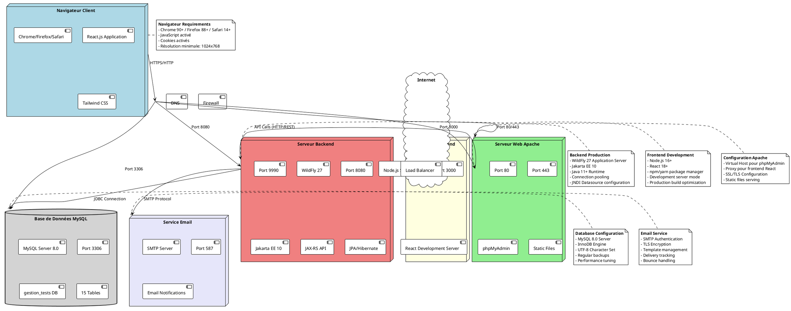

# Diagramme de Déploiement - Gestion des Tests en Ligne



## Diagramme de Déploiement Détaillé

### Architecture de Déploiement

#### **1. Couche Client (Navigateur)**
```
Navigateur Web
├── Chrome/Firefox/Safari (version récente)
├── Application React.js
├── Tailwind CSS pour le style
├── Axios pour les appels API
└── LocalStorage pour le cache
```

#### **2. Serveur Web Apache**
```
Apache HTTP Server
├── Port 80 (HTTP)
├── Port 443 (HTTPS)
├── Virtual Host Configuration
│   ├── phpMyAdmin (/phpmyadmin)
│   ├── Static assets (/static)
│   └── Proxy pour frontend (/)
├── SSL/TLS Certificate
└── ModSecurity (Firewall)
```

#### **3. Serveur Frontend Node.js**
```
Node.js Development Server
├── Port 3000
├── React Development Server
├── Hot Module Replacement (HMR)
├── Webpack Dev Server
└── CORS Configuration
```

#### **4. Serveur Backend WildFly**
```
WildFly Application Server 27
├── Port 8080 (HTTP Applications)
├── Port 9990 (Management Console)
├── Jakarta EE 10 Platform
│   ├── JAX-RS (REST API)
│   ├── JPA/Hibernate (ORM)
│   ├── CDI (Dependency Injection)
│   ├── EJB (Business Logic)
│   └── JTA (Transactions)
├── Connection Pooling
├── JNDI Resources
└── Security Realms
```

#### **5. Base de Données MySQL**
```
MySQL Server 8.0
├── Port 3306
├── Database: gestion_tests
├── Tables (15):
│   ├── candidats
│   ├── themes
│   ├── questions
│   ├── reponses_possibles
│   ├── sessions_test
│   ├── creneaux_horaires
│   ├── inscriptions
│   └── ...
├── InnoDB Storage Engine
├── UTF-8 Character Set
└── Performance Optimization
```

#### **6. Service Email**
```
SMTP Server
├── Port 587 (TLS)
├── Authentication Required
├── Email Templates
├── Queue Management
└── Delivery Tracking
```

### Configuration Réseau

#### **Ports Utilisés**
- **80** : Apache HTTP (redirection vers HTTPS)
- **443** : Apache HTTPS (phpMyAdmin, static files)
- **3000** : Node.js Frontend (développement)
- **8080** : WildFly Backend (API REST)
- **9990** : WildFly Management Console
- **3306** : MySQL Database
- **587** : SMTP Email

#### **Flux de Communication**
```
Client → Internet → Apache (Port 443)
                    ↓
                 Frontend (Port 3000)
                    ↓
                 Backend (Port 8080)
                    ↓
                 MySQL (Port 3306)
                    ↓
                 Email (Port 587)
```

### Configuration de Production

#### **Apache Virtual Host**
```apache
<VirtualHost *:443>
    ServerName gestion-tests.com
    DocumentRoot /var/www/gestion-tests
    
    # phpMyAdmin
    Alias /phpmyadmin /usr/share/phpmyadmin
    
    # Proxy vers frontend React
    ProxyPreserveHost On
    ProxyPass /api http://localhost:8080/gestion-tests-backend/api
    ProxyPassReverse /api http://localhost:8080/gestion-tests-backend/api
    
    # SSL Configuration
    SSLEngine on
    SSLCertificateFile /path/to/cert.pem
    SSLCertificateKeyFile /path/to/key.pem
</VirtualHost>
```

#### **WildFly Configuration**
```xml
<datasource jndi-name="java:/MySqlDS" pool-name="MySqlDS">
    <connection-url>jdbc:mysql://localhost:3306/gestion_tests</connection-url>
    <driver>mysql</driver>
    <security>
        <user-name>root</user-name>
        <password>root</password>
    </security>
</datasource>
```

### Sécurité

#### **Firewall Rules**
```
# Ports ouverts
- 80/tcp   (HTTP)
- 443/tcp  (HTTPS)
- 8080/tcp (Backend API - interne uniquement)
- 3306/tcp (MySQL - interne uniquement)

# Ports fermés
- 3000/tcp (Frontend dev - production uniquement)
- 9990/tcp (WildFly admin - interne uniquement)
```

#### **SSL/TLS Configuration**
- **Certificate** : Let's Encrypt ou certificat commercial
- **Protocols** : TLS 1.2 et 1.3 uniquement
- **Ciphers** : Suites de chiffrement modernes
- **HSTS** : HTTP Strict Transport Security activé

### Monitoring et Maintenance

#### **Logs**
- **Apache** : `/var/log/apache2/`
- **WildFly** : `/opt/wildfly/standalone/log/`
- **MySQL** : `/var/log/mysql/`
- **Node.js** : `/var/log/nodejs/`

#### **Sauvegardes**
- **MySQL** : Backup quotidien avec mysqldump
- **Application** : Backup des fichiers WAR/JAR
- **Configuration** : Backup des fichiers de config

#### **Monitoring**
- **Uptime** : UptimeRobot ou similaire
- **Performance** : New Relic, DataDog ou Prometheus
- **Logs** : ELK Stack ou Graylog
- **Alertes** : Email/Slack pour les incidents critiques

### Scalabilité

#### **Horizontal Scaling**
- **Load Balancer** : Nginx ou HAProxy
- **Multiple Backend Instances** : WildFly clustering
- **Database Replication** : MySQL Master-Slave
- **CDN** : CloudFlare pour les assets statiques

#### **Vertical Scaling**
- **CPU** : 4+ cores pour le backend
- **RAM** : 8GB+ pour WildFly + MySQL
- **Storage** : SSD avec IOPS élevés
- **Network** : Bande passante suffisante

### Environnements

#### **Développement**
```
Local Machine
├── Node.js :3000 (Frontend)
├── WildFly :8080 (Backend)
└── MySQL   :3306 (Database)
```

#### **Test/Staging**
```
Test Server
├── Apache  :443 (Reverse Proxy)
├── Node.js :3000 (Frontend)
├── WildFly :8080 (Backend)
└── MySQL   :3306 (Database)
```

#### **Production**
```
Production Server
├── Load Balancer :443
├── Apache        :443
├── WildFly Cluster :8080
└── MySQL Cluster :3306
```
